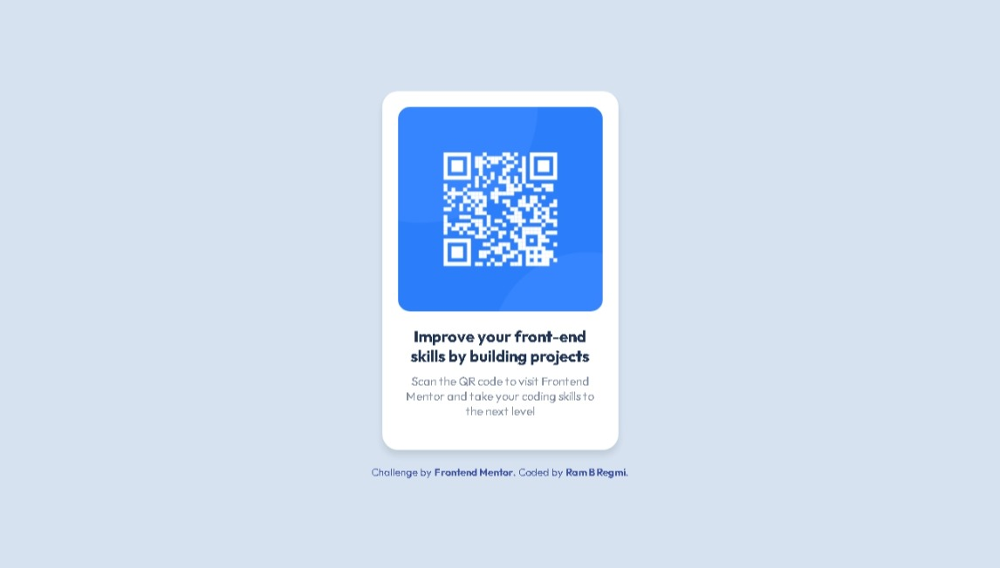

# Frontend Mentor - QR code component solution

This is a solution to the [QR code component challenge on Frontend Mentor](https://www.frontendmentor.io/challenges/qr-code-component-iux_sIO_H). Frontend Mentor challenges help you improve your coding skills by building realistic projects. 

## Table of contents

- [Frontend Mentor - QR code component solution](#frontend-mentor---qr-code-component-solution)
  - [Table of contents](#table-of-contents)
  - [Overview](#overview)
    - [Screenshot](#screenshot)
    - [Links](#links)
  - [My process](#my-process)
    - [Built with](#built-with)
    - [What I learned](#what-i-learned)
  - [Author](#author)

## Overview

### Screenshot

### Links

- Solution URL: [Add solution URL here](https://your-solution-url.com)
- Live Site URL: [Add live site URL here](https://your-live-site-url.com)

## My process

### Built with

- Semantic HTML5 markup
- CSS custom properties
- Flexbox
- Mobile-first workflow
- [Outfit](https://fonts.google.com/specimen/Outfit) font from Google Fonts

### What I learned

During the course of this project, I gained valuable experience and learned the following:

- How to structure web content using semantic HTML5 markup, enhancing accessibility and SEO.
- The usage of CSS custom properties (variables) to efficiently manage and apply consistent styles.
- Implementing responsive design principles with Flexbox, ensuring the project looks great on various screen sizes.
- The importance of a mobile-first workflow, which helps create a more user-friendly experience for mobile users.
- Integrating and styling web fonts, in this case, the [Outfit](https://fonts.google.com/specimen/Outfit) font from Google Fonts.

These skills and knowledge will undoubtedly be beneficial in future web development projects and contribute to my growth as a developer.

## Author

- Frontend Mentor - [@rr-tri](https://www.frontendmentor.io/profile/rr-tri)